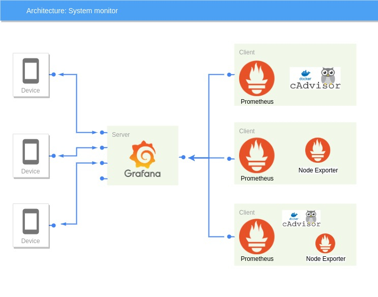

# Tumino - Sergi

## [SystemMonitor](SystemMonitor)

SystemMonitor is a tool designed for private and company, with lots of remote machine that always have to be monitored. Is possible to monitor the devices wherever you are, only need an internet connection.

SystemMonitor allows you to monitor several system's metrics. It's compatible with cluster of Docker's containers running on linux and with system debian-based.

This tool is based on a client-server architecture, in which the client is the system to be monitored and by the server side you can monitor the clients, through metrics and graphs.

## Client

The [client](SystemMonitor/Client) rapresent the system to be monitored, is composed by three tools:
- [Promtheus Node Exporter](https://github.com/prometheus/node_exporter);
- [CAdvisor](https://github.com/google/cadvisor);
- [Prometheus](https://prometheus.io/);

The first one, Prometheus Node Exporter, allows to expose hardware and OS metrics. It is written in Go and in this project is used to monitor the machine where it is intalled.

The second one, cAdvisor, is a docker's image created by Google that provides container users an understanding of the resource usage and performance characteristics of their running containers.

The last one, Prometheus, scraps information from the previous two and stores them. Prometheus is reachable from everywhere thanks to the exposure of the port to the web, in this project used by Grafana(see below).  

## Server

The main component on the [server](SystemMonitor/Server) side is [Grafana](https://grafana.com/).

Grafana is the most popular technology used to compose observability dashboards with everything. 
In this project Grafana uses informations scaped by Prometheus and creates SystemMonitor's dashboards for analisys of the main components of remote machines.

It is reachable from anywhere and any device, at the address and port specified, as long as you made it accessible outside your local network. 

The second component server side is a plugin for Grafana, [grafana-image-render](https://grafana.com/grafana/plugins/grafana-image-renderer) need to setup the alerting channel based on Telegram.

The alerts are settable as you prefer quickly and easly directly from Grafana interface. Grafana will send alerts whenever a value from Prometheus breaks the threshould setted by the user. The alerts will arrive directly on your device with Telegram installed above, with a snap of the situation on the remote machine.

